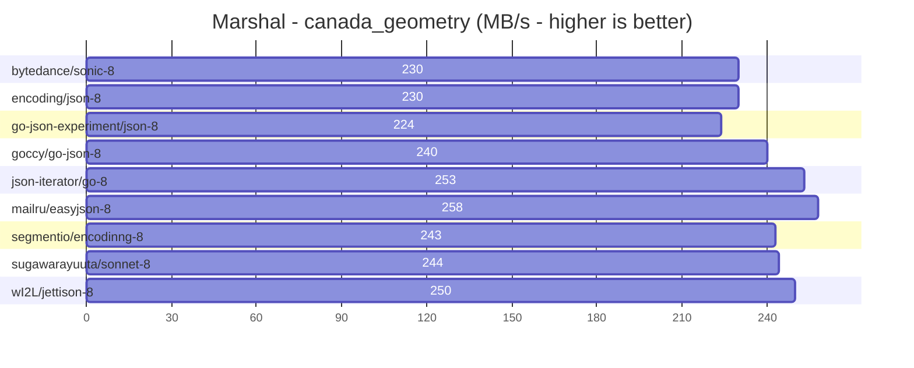
```mermaid
gantt
title Marshal - canada_geometry (MB/s - higher is better)
dateFormat X
axisFormat %s

section bytedance/sonic-8                 
230 :0, 230
section encoding/json-8         
230 :0, 230
section go-json-experiment/json-8         
224 :0, 224
section goccy/go-json-8                   
240 :0, 240
section json-iterator/go-8                
253 :0, 253
section mailru/easyjson-8                 
258 :0, 258
section segmentio/encodinng-8             
243 :0, 243
section sugawarayuuta/sonnet-8            
244 :0, 244
section wI2L/jettison-8                   
250 :0, 250
```

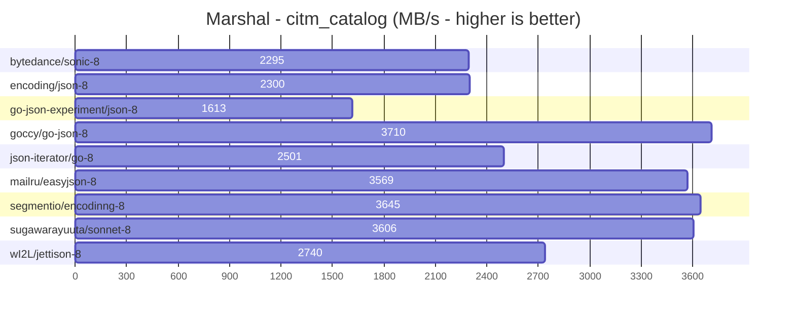
```mermaid
gantt
title Marshal - citm_catalog (MB/s - higher is better)
dateFormat X
axisFormat %s

section bytedance/sonic-8                    
2295 :0, 2295
section encoding/json-8                      
2300 :0, 2300
section go-json-experiment/json-8            
1613 :0, 1613
section goccy/go-json-8                      
3710 :0, 3710
section json-iterator/go-8                   
2501 :0, 2501
section mailru/easyjson-8                    
3569 :0, 3569
section segmentio/encodinng-8                
3645 :0, 3645
section sugawarayuuta/sonnet-8               
3606 :0, 3606
section wI2L/jettison-8                      
2740 :0, 2740
```

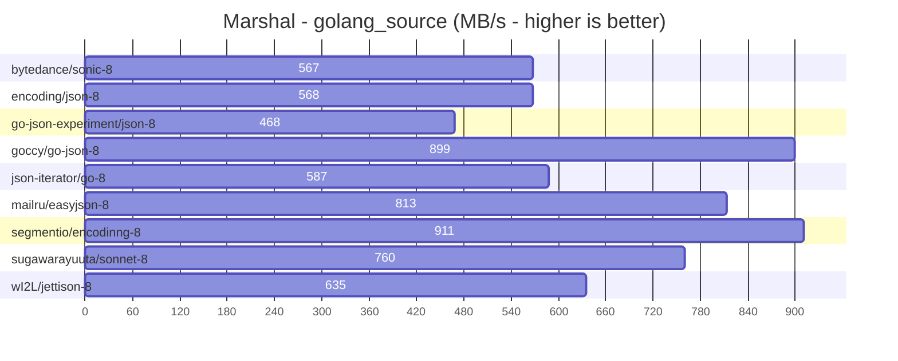
```mermaid
gantt
title Marshal - golang_source (MB/s - higher is better)
dateFormat X
axisFormat %s

section bytedance/sonic-8                   
567 :0, 567
section encoding/json-8                     
568 :0, 568
section go-json-experiment/json-8           
468 :0, 468
section goccy/go-json-8                     
899 :0, 899
section json-iterator/go-8                  
587 :0, 587
section mailru/easyjson-8                   
813 :0, 813
section segmentio/encodinng-8               
911 :0, 911
section sugawarayuuta/sonnet-8              
760 :0, 760
section wI2L/jettison-8                     
635 :0, 635
```

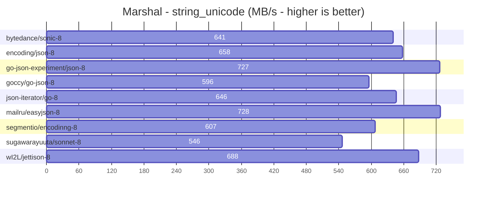
```mermaid
gantt
title Marshal - string_unicode (MB/s - higher is better)
dateFormat X
axisFormat %s

section bytedance/sonic-8                  
641 :0, 641
section encoding/json-8                    
658 :0, 658
section go-json-experiment/json-8          
727 :0, 727
section goccy/go-json-8                    
596 :0, 596
section json-iterator/go-8                 
646 :0, 646
section mailru/easyjson-8                  
728 :0, 728
section segmentio/encodinng-8              
607 :0, 607
section sugawarayuuta/sonnet-8             
546 :0, 546
section wI2L/jettison-8                    
688 :0, 688
```

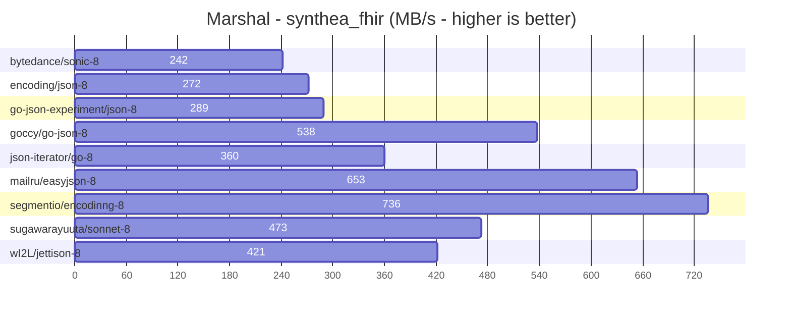
```mermaid
gantt
title Marshal - synthea_fhir (MB/s - higher is better)
dateFormat X
axisFormat %s

section bytedance/sonic-8                    
242 :0, 242
section encoding/json-8                      
272 :0, 272
section go-json-experiment/json-8            
289 :0, 289
section goccy/go-json-8                      
538 :0, 538
section json-iterator/go-8                   
360 :0, 360
section mailru/easyjson-8                    
653 :0, 653
section segmentio/encodinng-8                
736 :0, 736
section sugawarayuuta/sonnet-8               
473 :0, 473
section wI2L/jettison-8                      
421 :0, 421
```

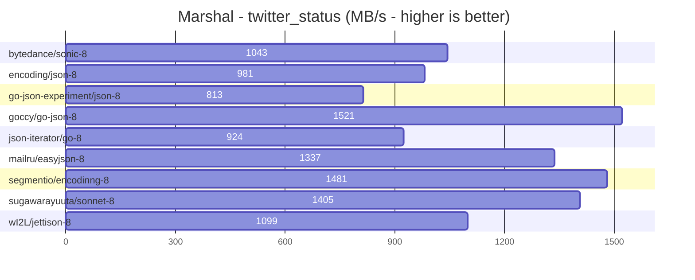
```mermaid
gantt
title Marshal - twitter_status (MB/s - higher is better)
dateFormat X
axisFormat %s

section bytedance/sonic-8                  
1043 :0, 1043
section encoding/json-8                    
981 :0, 981
section go-json-experiment/json-8          
813 :0, 813
section goccy/go-json-8                    
1521 :0, 1521
section json-iterator/go-8                 
924 :0, 924
section mailru/easyjson-8                  
1337 :0, 1337
section segmentio/encodinng-8              
1481 :0, 1481
section sugawarayuuta/sonnet-8             
1405 :0, 1405
section wI2L/jettison-8                    
1099 :0, 1099
```

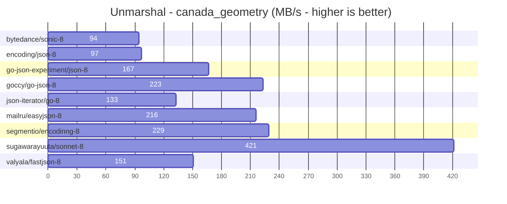
```mermaid
gantt
title Unmarshal - canada_geometry (MB/s - higher is better)
dateFormat X
axisFormat %s

section bytedance/sonic-8               
94 :0, 94
section encoding/json-8                 
97 :0, 97
section go-json-experiment/json-8       
167 :0, 167
section goccy/go-json-8                 
223 :0, 223
section json-iterator/go-8              
133 :0, 133
section mailru/easyjson-8               
216 :0, 216
section segmentio/encodinng-8           
229 :0, 229
section sugawarayuuta/sonnet-8          
421 :0, 421
section valyala/fastjson-8              
151 :0, 151
```

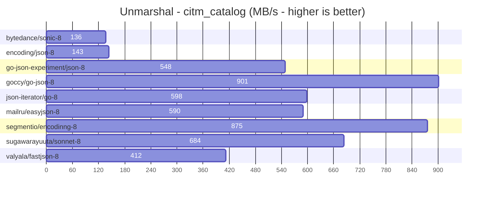
```mermaid
gantt
title Unmarshal - citm_catalog (MB/s - higher is better)
dateFormat X
axisFormat %s

section bytedance/sonic-8                  
136 :0, 136
section encoding/json-8                    
143 :0, 143
section go-json-experiment/json-8          
548 :0, 548
section goccy/go-json-8                    
901 :0, 901
section json-iterator/go-8                 
598 :0, 598
section mailru/easyjson-8                  
590 :0, 590
section segmentio/encodinng-8              
875 :0, 875
section sugawarayuuta/sonnet-8             
684 :0, 684
section valyala/fastjson-8                 
412 :0, 412
```

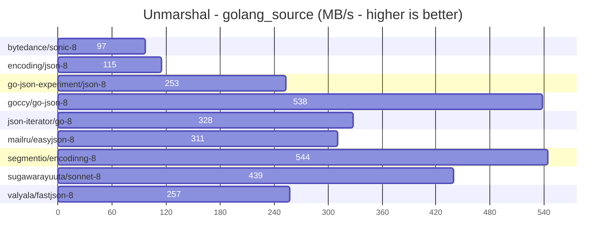
```mermaid
gantt
title Unmarshal - golang_source (MB/s - higher is better)
dateFormat X
axisFormat %s

section bytedance/sonic-8                 
97 :0, 97
section encoding/json-8                   
115 :0, 115
section go-json-experiment/json-8         
253 :0, 253
section goccy/go-json-8                   
538 :0, 538
section json-iterator/go-8                
328 :0, 328
section mailru/easyjson-8                 
311 :0, 311
section segmentio/encodinng-8             
544 :0, 544
section sugawarayuuta/sonnet-8            
439 :0, 439
section valyala/fastjson-8                
257 :0, 257
```

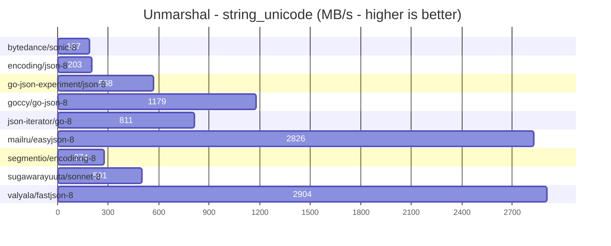
```mermaid
gantt
title Unmarshal - string_unicode (MB/s - higher is better)
dateFormat X
axisFormat %s

section bytedance/sonic-8                
187 :0, 187
section encoding/json-8                  
203 :0, 203
section go-json-experiment/json-8        
568 :0, 568
section goccy/go-json-8                  
1179 :0, 1179
section json-iterator/go-8               
811 :0, 811
section mailru/easyjson-8                
2826 :0, 2826
section segmentio/encodinng-8            
274 :0, 274
section sugawarayuuta/sonnet-8           
501 :0, 501
section valyala/fastjson-8               
2904 :0, 2904
```

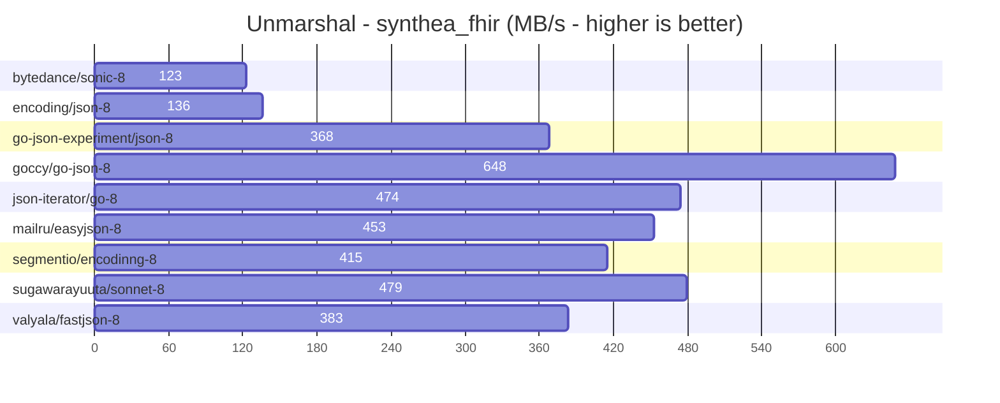
```mermaid
gantt
title Unmarshal - synthea_fhir (MB/s - higher is better)
dateFormat X
axisFormat %s

section bytedance/sonic-8                  
123 :0, 123
section encoding/json-8                    
136 :0, 136
section go-json-experiment/json-8          
368 :0, 368
section goccy/go-json-8                    
648 :0, 648
section json-iterator/go-8                 
474 :0, 474
section mailru/easyjson-8                  
453 :0, 453
section segmentio/encodinng-8              
415 :0, 415
section sugawarayuuta/sonnet-8             
479 :0, 479
section valyala/fastjson-8                 
383 :0, 383
```

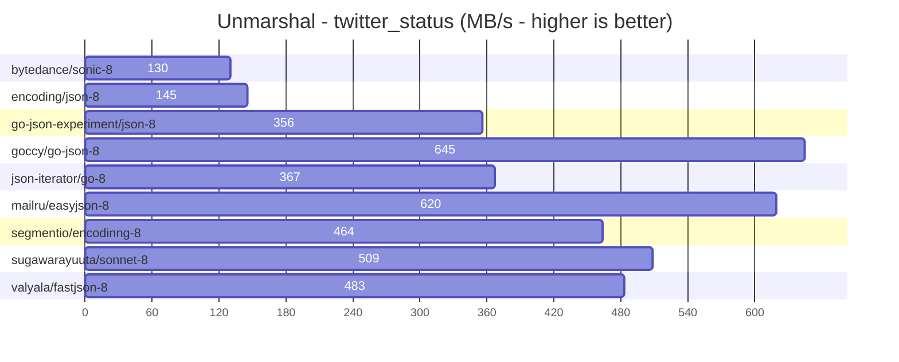
```mermaid
gantt
title Unmarshal - twitter_status (MB/s - higher is better)
dateFormat X
axisFormat %s

section bytedance/sonic-8                
130 :0, 130
section encoding/json-8                  
145 :0, 145
section go-json-experiment/json-8        
356 :0, 356
section goccy/go-json-8                  
645 :0, 645
section json-iterator/go-8               
367 :0, 367
section mailru/easyjson-8                
620 :0, 620
section segmentio/encodinng-8            
464 :0, 464
section sugawarayuuta/sonnet-8           
509 :0, 509
section valyala/fastjson-8               
483 :0, 483
```

